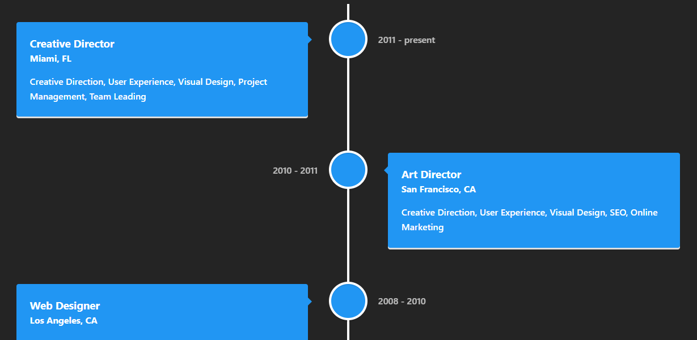
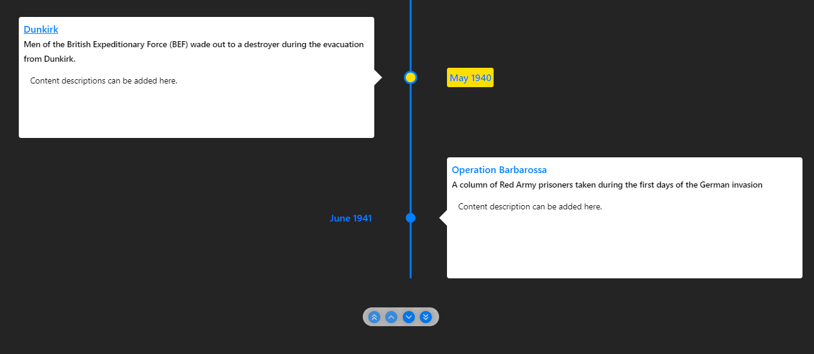
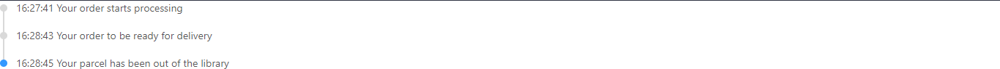
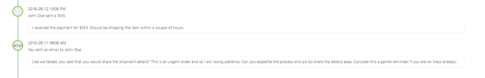
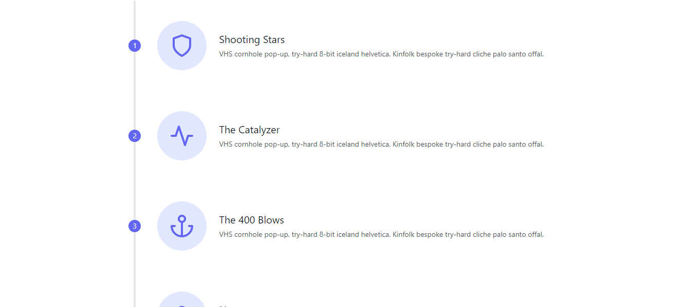

<h1 align="center">Best React Timeline Libraries.</h1>

<p>Keeping track of events and their chronological order is a crucial concept in the current dynamic world we live in. <b>Timelines</b> serve as a powerful tool to visualize the relationship between events and their occurrence. In the realm of web development, timelines are often employed to present a sequence of events, milestones, and important dates in websites and applications.</p> 
<p>If you're looking for a way to display events in a chronological order in your React Application, then this article is for you. We'll be exploring the best React timeline libraries that can help you create aesthetically pleasing and functional timelines for your projects.</p>

<h2>1. React Vertical Timeline Component</h2>
<p><a href="https://stephane-monnot.github.io/react-vertical-timeline/#/">React Vertical Timeline Component</a> is a simple and clean timeline component for ReactJS. It is a lightweight and customizable component that allows you to create a vertical timeline for your React projects.  React Vertical Timeline supports a variety of event types, including images, videos, and text, and is fully responsive, making it mobile-friendly. The library is also easy to integrate with other React components and libraries.</p>

<h3>Usage</h3>

- Install the library using npm.
    ```jsx
    npm install react-vertical-timeline-component --save
    ```
- Import the library in your React component. 
**Note:** The additional imports used in the example below are for the icons used in the timeline. You can use any icon library of your choice. In this case we picked <a href="https://material-ui.com/components/material-icons/)">Material UI</a> icons.

    ```jsx
    //React imports
    import React from 'react';
    //React Vertical Timeline Component imports
    import { VerticalTimeline, VerticalTimelineElement }  from 'react-vertical-timeline-component';
    import 'react-vertical-timeline-component/style.min.css';
    //Material UI Icons imports
    import WorkIcon from '@material-ui/icons/Work';
    import StarIcon from '@material-ui/icons/Star';
    import SchoolIcon from '@material-ui/icons/School';

    ```

- Create a React component and add the timeline elements. 
  
    ```jsx 
    // React Component called TimeLineComponent
    const TimeLineComponent = () => {
        //render the timeline
        return (
            {/*VerticalTimeline is the parent component, all VerticalTimelineElements should be wrapped inside it*/}
            <VerticalTimeline>
                {/* VerticalTimelineElement is the child component, it represents a single timeline element.*/}
                <VerticalTimelineElement
                    {/*The elements contain attributes that define their appearance and content.*/}
                    {/*Get element attributes from the library documentation. https://stephane-monnot.github.io/react-vertical-timeline/#/ */}
                    {/*All elements should have a date prop, which is a string that represents the date of the event.*/}
                    className="vertical-timeline-element--work"
                    contentStyle={{ background: 'rgb(33, 150, 243)', color: '#fff' }}
                    contentArrowStyle={{ borderRight: '7px solid  rgb(33, 150, 243)' }}
                    date="2011 - present"
                    iconStyle={{ background: 'rgb(33, 150, 243)', color: '#fff' }}
                    {/*The icon prop is used to add an icon to the timeline element. In this case we used our choice of icon library to add an icon.*/}
                    icon={<WorkIcon />}
                >
                    <h3 className="vertical-timeline-element-title">Creative Director</h3>
                    <h4 className="vertical-timeline-element-subtitle">Miami, FL</h4>
                    <p>Creative Direction, User Experience, Visual Design, Project Management, Team Leading</p>
                </VerticalTimelineElement>
                {/*You can add as many VerticalTimelineElements as you want.*/}
                <VerticalTimelineElement
                    {/*insert element attributes here*/}
                >
                    {/*insert element content here*/}
                    <h3 className="vertical-timeline-element-title">Content Title Goes Here</h3>
                    <h4 className="vertical-timeline-element-subtitle">Content Subtitle Goes Here</h4>
                    <p>Content paragraph or description goes here</p>
                </VerticalTimelineElement>
            </VerticalTimeline>
        )
    }

- After following the steps and creating more VerticalTimelineElements, (content can be passed in dynamically using props), the timeline should have a similar appearance to this and is completely modifiable using CSS. Simple right?
</img>

<h2>2. React-Chrono</h2>

<p><a href="https://react-chrono.prabhumurthy.com/introduction/getting-started.html">React-Chrono</a> If you're a fan of building object separately for your components to make your work clean and readable, React-Chrono should be your library of choice. React-Chrono is a versatile timeline component that allows developers to render beautiful timelines with ease. It is designed to be data-driven and is flexible and straightforward to use, making it ideal for developers who want to create visually stunning timelines quickly.</p>

<h3>Usage</h3>

- Install the library using npm.
    ```jsx
    npm install react-chrono --save
    ```
- Import the library in your React component.

    ```jsx
    //React imports
    import React from 'react';
    //React-Chrono imports
    import { Chrono } from "react-chrono";
    ```
- Create a React component and add the timeline elements. 
- Building the timeline, you need to create a data object that contains the timeline elements. The data object should be an array of objects, each object represents a timeline element. The object should contain the following properties: 
-  **title:** The title of the timeline element.
-  **cardTitle:** The title of the timeline element card.
-  **cardSubtitle:** The subtitle of the timeline element card.
-  **cardDetailedText:** The detailed text of the timeline element card.
-  The data is fed through the <code>items</code> prop of the Chrono component.
-  The second prop <code>mode</code> is used to define the layout of the timeline. The library supports 3 modes: <code>HORIZONTAL</code>, <code>VERTICAL</code>, and <code>VERTICAL_ALTERNATING</code>. Here we've used the VERTICAL_ALTERNATING mode.
- The library is completely customizable, checkout more props that you can use from the <a href="https://react-chrono.prabhumurthy.com/introduction/getting-started.html">documentation</a>
  
    ```jsx
    // React Component called TimeLineComponent
    const TimeLineComponent = () => {
        //create the data object
        const items = [
            {
            title: "May 1940",
            cardTitle: "Dunkirk",
            url: "http://google.com",
            cardSubtitle:"Men of the British Expeditionary Force (BEF) wade out to a destroyer during the evacuation from Dunkirk.",
            cardDetailedText: `Content descriptions can be added here.`
        },
        {
            title: "June 1941",
            cardTitle: "Operation Barbarossa",
            cardSubtitle: `A column of Red Army prisoners taken during the first days of the German invasion`,
            cardDetailedText: `Content description can be added here.`
        }
        
        ]
        return (
            <div>
                {/*Chrono is the parent component, all timeline elements should be wrapped inside it*/}
                {/* React Chrono Component, takes in items as it's main prop and mode to determine whether it should display content vertically or dynamically*/ }
                <Chrono items={items} mode="VERTICAL_ALTERNATING" />
            </div>
        )
    }

- After following these steps you should have a similar timeline to this.
</img>


<h2>3. React Suite</h2>
<p>Unlike the libraries mentioned above, <a href="https://rsuitejs.com/components/timeline/">React Suite</a>/rsuite is a UI library that contains a variety of components that can be used to build a timeline. The library is highly customizable and has a variety of components that can be used to build a timeline. Building a timeline with rsuite is quite easy and straight forward. </p>

<h3>Usage</h3>

- Install the library using npm.
  
    ```jsx
    npm install rsuite --save
    ```
- Import the library in your React component.

    ```jsx
    //React imports
    import React from 'react';
    //React Suite imports
    import { Timeline, TimelineItem } from 'rsuite';
    ```
- Create a React component and add the timeline elements.

    ```jsx
    // React Component called TimeLineComponent
    const TimeLineComponent = ()=> {
        return (
            <Timeline>
                <Timeline.Item>16:27:41 Your order starts processing</Timeline.Item>
                <Timeline.Item>16:28:43 Your order to be ready for delivery</Timeline.Item>
                <Timeline.Item>16:28:45 Your parcel has been out of the library</Timeline.Item>
            </Timeline>
        )
    }

- This should result to a similar timeline to this.

</img>


<h2>4. React event timeline.</h2>

<p><a href="https://rcdexta.com/react-event-timeline/?selectedKind=Timeline&selectedStory=Default%20View&full=0&addons=0&stories=1&panelRight=0">React event timeline</a> is also a straightforward timeline library that is easy to implement with a simple UI, it is also highly customizable and has a variety of components that can be used to build a timeline. Building a timeline with React event timeline is quite easy and straight forward. </p>    

<h3>Usage</h3>

- Install the library using npm.
  
    ```jsx
    npm install react-event-timeline --save
    ```

- Import the library in your React component.

    ```jsx
    //React imports
    import React from 'react';
    //React event timeline imports
    import { Timeline, TimelineEvent } from 'react-event-timeline';
    ```
- Create a React component and add the timeline elements.

    ```jsx
    // React Component called TimeLineComponent
    const TimeLineComponent = ()=> {
        return (
            <Timeline>
                <TimelineEvent title="John Doe sent a SMS" createdAt="2016-09-12 10:06 PM" icon={<i className="material-icons md-18">textsms</i>}>
                    I received the payment for $543. Should be shipping the item within a couple of hours.
                </TimelineEvent>
                <TimelineEvent
                    title="You sent an email to John Doe"
                    createdAt="2016-09-11 09:06 AM"
                    icon={<i className="material-icons md-18">email</i>}
                >
                    Like we talked, you said that you would share the shipment details? This is an urgent order and so I
                    am losing patience. Can you expedite the process and pls do share the details asap. Consider this a
                    gentle reminder if you are on track already!
                </TimelineEvent>
            </Timeline>
        )
    }

- This should result to a similar timeline to this.

</img>

<h5>Tailwind css/Tailblocks</h5>

<p> If  you are using tailwind css, and you aren't looking to install other dependancies for your React app, you can use <a href="https://tailblocks.cc/">tailblocks</a> to build a timeline. Tailblocks is a collection of ready to use Tailwind CSS blocks. It has a variety of components that can be used to build a timeline. Building a timeline with tailblocks is quite easy and straight forward. This also helps you save on space since we are not installing any other libraries apart from the official Tailwind CSS framework. </p>

<h3>Usage</h3>

- Install the tailwind css framework. Set up tailwind in your React app. Guide to setting it up is well outlined in the official documentation.
  
    ```jsx
    npm install -D tailwindcss postcss autoprefixer
    npx tailwindcss init -p
    ```

- Create a React component and add the timeline elements.

    ```jsx
    // React Component called TimeLineComponent
    const TimeLineComponent = ()=> {
        return (

            <section class="text-gray-600 body-font">
                <div class="container px-5 py-24 mx-auto flex flex-wrap">
                    <div class="flex relative pt-10 pb-20 sm:items-center md:w-2/3 mx-auto">
                    <div class="h-full w-6 absolute inset-0 flex items-center justify-center">
                        <div class="h-full w-1 bg-gray-200 pointer-events-none"></div>
                    </div>
                    <div class="flex-shrink-0 w-6 h-6 rounded-full mt-10 sm:mt-0 inline-flex items-center justify-center bg-indigo-500 text-white relative z-10 title-font font-medium text-sm">1</div>
                    <div class="flex-grow md:pl-8 pl-6 flex sm:items-center items-start flex-col sm:flex-row">
                        <div class="flex-shrink-0 w-24 h-24 bg-indigo-100 text-indigo-500 rounded-full inline-flex items-center justify-center">
                        <svg fill="none" stroke="currentColor" stroke-linecap="round" stroke-linejoin="round" stroke-width="2" class="w-12 h-12" viewBox="0 0 24 24">
                            <path d="M12 22s8-4 8-10V5l-8-3-8 3v7c0 6 8 10 8 10z"></path>
                        </svg>
                        </div>
                        <div class="flex-grow sm:pl-6 mt-6 sm:mt-0">
                        <h2 class="font-medium title-font text-gray-900 mb-1 text-xl">Shooting Stars</h2>
                        <p class="leading-relaxed">VHS cornhole pop-up, try-hard 8-bit iceland helvetica. Kinfolk bespoke try-hard cliche palo santo offal.</p>
                        </div>
                    </div>
                    </div>
                    <div class="flex relative pb-20 sm:items-center md:w-2/3 mx-auto">
                    <div class="h-full w-6 absolute inset-0 flex items-center justify-center">
                        <div class="h-full w-1 bg-gray-200 pointer-events-none"></div>
                    </div>
                    <div class="flex-shrink-0 w-6 h-6 rounded-full mt-10 sm:mt-0 inline-flex items-center justify-center bg-indigo-500 text-white relative z-10 title-font font-medium text-sm">2</div>
                    <div class="flex-grow md:pl-8 pl-6 flex sm:items-center items-start flex-col sm:flex-row">
                        <div class="flex-shrink-0 w-24 h-24 bg-indigo-100 text-indigo-500 rounded-full inline-flex items-center justify-center">
                        <svg fill="none" stroke="currentColor" stroke-linecap="round" stroke-linejoin="round" stroke-width="2" class="w-12 h-12" viewBox="0 0 24 24">
                            <path d="M22 12h-4l-3 9L9 3l-3 9H2"></path>
                        </svg>
                        </div>
                        <div class="flex-grow sm:pl-6 mt-6 sm:mt-0">
                        <h2 class="font-medium title-font text-gray-900 mb-1 text-xl">The Catalyzer</h2>
                        <p class="leading-relaxed">VHS cornhole pop-up, try-hard 8-bit iceland helvetica. Kinfolk bespoke try-hard cliche palo santo offal.</p>
                        </div>
                    </div>
                    </div>
                    <div class="flex relative pb-20 sm:items-center md:w-2/3 mx-auto">
                    <div class="h-full w-6 absolute inset-0 flex items-center justify-center">
                        <div class="h-full w-1 bg-gray-200 pointer-events-none"></div>
                    </div>
                    <div class="flex-shrink-0 w-6 h-6 rounded-full mt-10 sm:mt-0 inline-flex items-center justify-center bg-indigo-500 text-white relative z-10 title-font font-medium text-sm">3</div>
                    <div class="flex-grow md:pl-8 pl-6 flex sm:items-center items-start flex-col sm:flex-row">
                        <div class="flex-shrink-0 w-24 h-24 bg-indigo-100 text-indigo-500 rounded-full inline-flex items-center justify-center">
                        <svg fill="none" stroke="currentColor" stroke-linecap="round" stroke-linejoin="round" stroke-width="2" class="w-12 h-12" viewBox="0 0 24 24">
                            <circle cx="12" cy="5" r="3"></circle>
                            <path d="M12 22V8M5 12H2a10 10 0 0020 0h-3"></path>
                        </svg>
                        </div>
                        <div class="flex-grow sm:pl-6 mt-6 sm:mt-0">
                        <h2 class="font-medium title-font text-gray-900 mb-1 text-xl">The 400 Blows</h2>
                        <p class="leading-relaxed">VHS cornhole pop-up, try-hard 8-bit iceland helvetica. Kinfolk bespoke try-hard cliche palo santo offal.</p>
                        </div>
                    </div>
                    </div>
                    <div class="flex relative pb-10 sm:items-center md:w-2/3 mx-auto">
                    <div class="h-full w-6 absolute inset-0 flex items-center justify-center">
                        <div class="h-full w-1 bg-gray-200 pointer-events-none"></div>
                    </div>
                    <div class="flex-shrink-0 w-6 h-6 rounded-full mt-10 sm:mt-0 inline-flex items-center justify-center bg-indigo-500 text-white relative z-10 title-font font-medium text-sm">4</div>
                    <div class="flex-grow md:pl-8 pl-6 flex sm:items-center items-start flex-col sm:flex-row">
                        <div class="flex-shrink-0 w-24 h-24 bg-indigo-100 text-indigo-500 rounded-full inline-flex items-center justify-center">
                        <svg fill="none" stroke="currentColor" stroke-linecap="round" stroke-linejoin="round" stroke-width="2" class="w-12 h-12" viewBox="0 0 24 24">
                            <path d="M20 21v-2a4 4 0 00-4-4H8a4 4 0 00-4 4v2"></path>
                            <circle cx="12" cy="7" r="4"></circle>
                        </svg>
                        </div>
                        <div class="flex-grow sm:pl-6 mt-6 sm:mt-0">
                        <h2 class="font-medium title-font text-gray-900 mb-1 text-xl">Neptune</h2>
                        <p class="leading-relaxed">VHS cornhole pop-up, try-hard 8-bit iceland helvetica. Kinfolk bespoke try-hard cliche palo santo offal.</p>
                        </div>
                    </div>
                    </div>
                </div>
            </section>
        )
    }
    ```

- With the code written above using tailwind css inbuilt class attributes, you should have a clean UI that is similar to a timeline, your work is to modify it according to your needs. 

</img>

